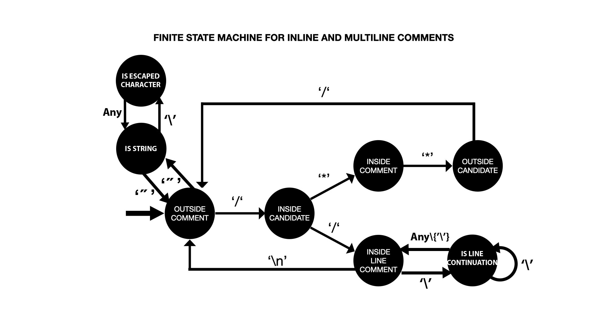

# CCommentator
Removes all code except c/c++ type comments from source files.
The idea is to see how well commented your source files are.
If they tell a story without the need to understand the code, you're good to go.
If not, somebody needs write a story.

This program is also an exercice to get introduced to Finite State Machine and their use in syntax analysis.

### State Machine Diagram


### Compile
Clone project:

    $ git clone https://github.com/bouzinabdotcom/CCommentator

Go to directory:

    $ cd CCommetator

Make:

    $ make

### Run
To run to tool:

    $ ./ccommentator filename [newfilename]
The brackets mean that newfilename is optional the output file will automatically be comments.filename

Example:

    $ ./ccommentator source.c


Outputs comments.source.c on the same directory.

### Let's get meta
Let's use ccommentator on it's source code!

    $ ./ccommentator main.c

main.c

```c
#include<stdio.h>
#include<stdlib.h>
#include<string.h>
#include "comment_sm.h"

void printhelp(){
    /**
     * 
     * Prints help
    */
    puts("How to use:");
    puts("$ ./ccommentator filename [newfilename]");
}

void removeCode(char *filename, char *newfilename) {

    /**
     * 
     * Function that does all the io
     * reads filename
     * writes to newfilename
     * 
    */
    FILE *f = NULL; //pointer on filename
    FILE *nf = NULL; //pointer on newfilename
    char c, cc; //variables that hold characters for testing and writing
    enum cursorState cs = OUTSIDECOMMENT; //initialise state of cursor to outside comment.. entry state
    int wasInsideCandidate = 0; //holds previous insidecandidate state
    int wasOutsideCandidate = 0; //holds previous outsidecomment state


    if((f = fopen(filename, "r"))) { //if filename is openned for reading succesfully

        if((nf = fopen(newfilename, "w"))){ // if newfilename is openned for writing successfully

            while((c=fgetc(f)) != EOF) { //read characters one at a time from filename

                setCursorState(&cs, c); //set the cursor state for the current character

                switch(cs){
                    case OUTSIDECOMMENT: //if we are outside of comments
                        wasInsideCandidate = 0; //reinnitialize previous inside candidate state
                        if(wasOutsideCandidate){ //if the previous state was OUTSIDECANDIDATE
                            fseek(f, ftell(f) - 2, SEEK_SET); //move cursor 2 chars back  
                            cc = fgetc(f); //read previously omitTed char OUTSIDECANDIDATE
                            fputc(cc, nf); //write it to newfilename
                            cc = fgetc(f); //read a char == c
                            fputc(cc, nf); //write it to newfilename
                            wasOutsideCandidate = 0; //set prev state to 0
                        }
                        else //if it wasnt a candidate
                            if(c=='\n') //if it's a line break
                            fputc(c, nf); //write it
                            else fputc(' ', nf); //if its any other character print a space
                        break;
                    //if we are inside a comment whatever it's type
                    case INSIDECOMMENT:
                    case INSIDELINECOMMENT:
                        if(wasInsideCandidate || wasOutsideCandidate){ 
                            /**
                             * in both cases where the cursor was OUTSIDECANDIDATE or INSIDECANDIDATE
                             * we need to write the previous character since it's inside a comment
                             * 
                            */
                            fseek(f, ftell(f) - 2, SEEK_SET); //take cursor 2 chars back
                            cc = fgetc(f); //read previously omitTed char
                            fputc(cc, nf); //write it
                            fseek(f, ftell(f) + 1, SEEK_SET); //move the cursor one char (c)
                            wasOutsideCandidate = 0; //reset both previous states
                            wasInsideCandidate=0;


                        }
                        fputc(c, nf); //write c
                        break;
                    case INSIDECANDIDATE:   //if the cursor is pointing on a candidate to a comment start
                        wasInsideCandidate=1; // save that state 
                        break;
                    case OUTSIDECANDIDATE: // if the cursor is pointing on a candidate to a comment end
                        wasOutsideCandidate = 1; // save that state 
                        break;
                    //no default case (enum)


                }
                
            }

            fclose(nf); //close newfilename
        }
        else{ //error handling for opening for reading problems (ex: permissions)
            puts("Error: couldn\'t open file for writing.");
            printf("file: %s\n", newfilename);
            exit(EXIT_FAILURE);
        }

        fclose(f); //close filename

    }
    else{ //error handling for opening for reading problems (ex: permissions)
        puts("Error: couldn\'t open file for reading.");
        printf("file: %s\n", filename);

        exit(EXIT_FAILURE);
    }


}

void parse_args(int argc, char *argv[], char** filename, char** newfilename){

    /**
     * Parses arguments and alters filename and newfilename
     * 
     * 
    */
    switch(argc) {
        case 1:  //if only on arg is suplied (executable name)
            // handle error
            puts("Error: Please specify a file"); 
            printhelp();
            exit(EXIT_FAILURE);
            break;
        case 2: //if one extra argument is suplied (missing newfilename)
            *filename = *(argv+1); //point to it using filename
             //allocate memory for newfilename as big as the size of filename plus a "comments." copied to the beginning
            *newfilename = (char*)malloc((strlen(*filename)+strlen("comments."))*sizeof(char));
            strcpy(*newfilename, "comments."); //put comments. in the beginning
            strcat(*newfilename, *filename); //add filename after comment.
            break;
        case 3: //if 2 extra arguments are suplied
            //just point to them
            *filename = *(argv+1);
            *newfilename = *(argv+2);
            break;
        default: //if more arguments -> too many arguments and print help
            puts("Error: too many arguments.");
            printhelp();
            exit(EXIT_FAILURE);


    }
}

int main(int argc, char *argv[]){

   

    char *filename = NULL, *newfilename = NULL;

    parse_args(argc, argv, &filename, &newfilename); //parse command line arguments

    removeCode(filename, newfilename); //remove code
    
    //Garbage Collection
    if(argc==2 && newfilename!=NULL) free(newfilename);
    return 0;
}
```

comments.main.c:

```c
                 
                  
                  
                       

                 
    /**
     * 
     * Prints help
    */
                        
                                                   
 

                                                    

    /**
     * 
     * Function that does all the io
     * reads filename
     * writes to newfilename
     * 
    */
                    //pointer on filename
                     //pointer on newfilename
                //variables that hold characters for testing and writing
                                          //initialise state of cursor to outside comment.. entry state
                                //holds previous insidecandidate state
                                 //holds previous outsidecomment state


                                     //if filename is openned for reading succesfully

                                            // if newfilename is openned for writing successfully

                                         //read characters one at a time from filename

                                        //set the cursor state for the current character

                           
                                         //if we are outside of comments
                                                //reinnitialize previous inside candidate state
                                                 //if the previous state was OUTSIDECANDIDATE
                                                              //move cursor 2 chars back  
                                           //read previously omitTed char OUTSIDECANDIDATE
                                           //write it to newfilename
                                           //read a char == c
                                           //write it to newfilename
                                                     //set prev state to 0
                         
                             //if it wasnt a candidate
                                        //if it's a line break
                                          //write it
                                                 //if its any other character print a space
                              
                    //if we are inside a comment whatever it's type
                                       
                                           
                                                                       
                            /**
                             * in both cases where the cursor was OUTSIDECANDIDATE or INSIDECANDIDATE
                             * we need to write the previous character since it's inside a comment
                             * 
                            */
                                                              //take cursor 2 chars back
                                           //read previously omitTed char
                                           //write it
                                                              //move the cursor one char (c)
                                                     //reset both previous states
                                                 


                         
                                      //write c
                              
                                            //if the cursor is pointing on a candidate to a comment start
                                              // save that state 
                              
                                           // if the cursor is pointing on a candidate to a comment end
                                                 // save that state 
                              
                    //no default case (enum)


                 
                
             

                        //close newfilename
         
              //error handling for opening for reading problems (ex: permissions)
                                                            
                                              
                               
         

                   //close filename

     
          //error handling for opening for reading problems (ex: permissions)
                                                        
                                       

                           
     


 

                                                                             

    /**
     * Parses arguments and alters filename and newfilename
     * 
     * 
    */
                  
                 //if only on arg is suplied (executable name)
            // handle error
                                                  
                        
                               
                  
                //if one extra argument is suplied (missing newfilename)
                                   //point to it using filename
             //allocate memory for newfilename as big as the size of filename plus a "comments." copied to the beginning
                                                                                               
                                               //put comments. in the beginning
                                             //add filename after comment.
                  
                //if 2 extra arguments are suplied
            //just point to them
                                  
                                     
                  
                 //if more arguments -> too many arguments and print help
                                               
                        
                               


     
 

                                 

   

                                               

                                                     //parse command line arguments

                                       //remove code
    
    //Garbage Collection
                                                       
             
 
```

Can you understand what it does ?

### A little story :
This tool came to be after I saw one of my progamming profs. use a [python script](https://github.com/thierryseegers/Commentator) to strip source files out of their code leaving just the comments and as always I got curious about it. So I tried to replicate it using basic tests to search for comments and leave them while replacing characters outside the comments with whitespace. I got lost in the complexity and was sure there was a better way to doing it. 
The better (and easier) route was to ask for the script's source code, read it, understand it and then try to replicate it.
So I did that and got a detailed response containing, in addition to the source code (that turned out to be using libclang through python), a roadmap to illuminate the pathway leading to creating my own version (Thanks a lot!). 


